:html_theme.sidebar_secondary.remove:

.. title:: CDSS

.. grid:: 2

   .. grid-item-card:: ✅ Protocol Evaluation
      :link: /guide/scoring
      :link-type: doc
      :text-align: center
      :class-card: sd-shadow-md sd-rounded-4

      **Score protocols** for a patient based on clinical condition and RGS activities interaction data.

   .. grid-item-card:: ℹ️ Prescriptions Recommendation
      :link: /guide/index
      :link-type: doc
      :text-align: center
      :class-card: sd-shadow-md sd-rounded-4

      **Protocol prescription** decision making algorithm explanation.

.. toctree::
   :hidden:

   Docs <guide/index>
   API <api/index>