# Class diagram

Renders as Mermaid in GitHub / VS Code (`bierner.markdown-mermaid`)
/ Obsidian. Coverage: every public class / Protocol / dataclass in
`src/ai_cdss/`. Methods abbreviated for clarity; full signatures live
in the source files.

## Overview — top to bottom by stage

```mermaid
classDiagram
    %% ============================================================
    %%  ENTRY POINT
    %% ============================================================
    class CDSSInterface {
        +repository: CohortRepository
        +pipeline: DataPipeline
        +debug: bool
        +debug_service: DebugReport
        +recommend_for_patients(ids, n, days, ppd, scoring_date, force) Dict
        +recommend_for_study(study_id, ...) Dict
        +compute_patient_fit(ids) Dict
        +compute_protocol_similarity() Dict
    }

    class DebugReport {
        +base_dir: Path
        +dump_df(df, run_id, name) str
        +preview_df(df) str
        +make_artifacts(run_id, scores, recs, ...) dict
    }

    CDSSInterface --> DebugReport : owns when debug=True

    %% ============================================================
    %%  DATA INGEST  (Repository pattern — Cohort + CohortRepository)
    %% ============================================================
    class CohortRepository {
        <<Protocol>>
        +find(patient_ids) Cohort
    }

    class RGSCohortRepository {
        +interface: DatabaseInterface
        +rgs_mode: str
        +whitelist: list~int~
        +find(patient_ids) Cohort
        +patient_subscales(ids) DataFrame
        +protocol_attributes(path) DataFrame
        +fetch_and_validate_patients(study_ids) list
    }

    class Cohort {
        <<frozen dataclass>>
        +patient: DataFrame
        +session: DataFrame
        +ppf: DataFrame
        +similarity: DataFrame
        +whitelist: list~int~
        +missing_ppf: list~int~
    }

    class ClinicalSubscales {
        +scales_path: Path
        +scales_dict: MultiKeyDict
        +compute_deficit_matrix(df) DataFrame
    }

    class ProtocolToClinicalMapper {
        +mapping_path: Path
        +mapping: MultiKeyDict
        +map_protocol_features(df, agg_func) DataFrame
    }

    class compute {
        <<module — pure functions>>
        +compute_ppf_for_patients(subscales, attrs, ...) DataFrame
        +persist_ppf(df, path) Path
        +compute_protocol_similarity_matrix(attrs, ...) DataFrame
        +persist_similarity(df, path) Path
    }

    RGSCohortRepository ..|> CohortRepository : implements
    CDSSInterface --> CohortRepository : owns
    RGSCohortRepository ..> Cohort : produces
    compute ..> ClinicalSubscales : uses
    compute ..> ProtocolToClinicalMapper : uses
    CDSSInterface ..> compute : calls for PPF / similarity

    %% ============================================================
    %%  PIPELINE  (RawInputs → ScoringOutput, typed at every step)
    %% ============================================================
    class DataPipeline {
        +imputer: Imputer
        +scorer: Scorer
        +process(cohort, scoring_date) DataFrame
        -_prepare(cohort, date) PreparedInputs
        -_build_features(inputs, date) MergedFeatures
        -_impute_features(features) ScoringInput
        -_score(input, prepared) ScoringOutput
    }

    class Imputer {
        +init_metrics(df) DataFrame
        +impute_metrics(df, column, values) DataFrame
    }

    class Scorer {
        +weights: list~float~
        +compute_score(df) DataFrame
    }

    class PreparedInputs {
        <<frozen dataclass + validation>>
        +patient: DataFrame
        +session: DataFrame
        +ppf: DataFrame
        +has_sessions: bool
    }

    class SessionLevelFeatures {
        <<frozen dataclass>>
        +df: DataFrame
    }

    class ProtocolLevelFeatures {
        <<frozen dataclass>>
        +df: DataFrame
    }

    class MergedFeatures {
        <<frozen dataclass>>
        +df: DataFrame
    }

    class ScoringInput {
        <<frozen dataclass>>
        +df: DataFrame
    }

    class ScoringOutput {
        <<frozen dataclass>>
        +df: DataFrame
        +attrs: dict
    }

    CDSSInterface --> DataPipeline : owns
    DataPipeline --> Imputer : owns
    DataPipeline --> Scorer : owns
    DataPipeline ..> Cohort : consumes
    DataPipeline ..> PreparedInputs : produces internally
    DataPipeline ..> SessionLevelFeatures : produces internally
    DataPipeline ..> ProtocolLevelFeatures : produces internally
    DataPipeline ..> MergedFeatures : produces internally
    DataPipeline ..> ScoringInput : produces internally
    DataPipeline ..> ScoringOutput : produces internally

    %% ============================================================
    %%  ENGINE  (Protocols + substrate adapters)
    %% ============================================================
    class EngineState {
        <<Protocol>>
        +patient_id: int
        +has_data: bool
        +all_protocols: list~int~
        +prescribed_rows: list~ProtocolRow~
        +is_week_skipped() bool
        +top_protocols(n) list~int~
        +lowest_scoring_prescribed: int
        +usage_of(pid) int
        +protocols_with_zero_usage: list~int~
        +score_row(pid) ProtocolRow
        +scoring_attrs: dict
    }

    class SimilarityMatrix {
        <<Protocol>>
        +similarities_for(pid, exclude) list
        +top_n_similar(pid, n, exclude) list~int~
    }

    class ProtocolRow {
        <<dataclass>>
        +patient_id: int
        +protocol_id: int
        +score: float
        +days: list~int~
        +usage: int
        +usage_week: int
        +ppf: float
        +delta_dm: float
        +recent_adherence: float
        +weeks_since_start: int
        +contrib: list~float~
        +as_dict() dict
        +from_dict(row) ProtocolRow$
    }

    class PatientState {
        +scoring: DataFrame
        +patient_id: int
        +rows: DataFrame
        ~_has_days_mask: Series (cached)
        ~_prescribed_slice: DataFrame (cached)
        ~_row_by_protocol: dict (cached)
        ~_sorted_by_score: list (cached)
    }

    class DictPatientState {
        +patient_id: int
        ~_rows: dict
        ~_sorted_by_score: list
        +with_prescribed_set(days_by_proto) DictPatientState
        +from_rows(pid, rows) DictPatientState$
    }

    class DataFrameSimilarity {
        ~_table: DataFrame
        ~_by_a: dict (precomputed)
    }

    class DictSimilarity {
        ~_pairs: dict
        ~_by_a: dict (precomputed)
    }

    PatientState ..|> EngineState : implements
    DictPatientState ..|> EngineState : implements
    DataFrameSimilarity ..|> SimilarityMatrix : implements
    DictSimilarity ..|> SimilarityMatrix : implements

    %% ============================================================
    %%  RECOMMENDATION CORE
    %% ============================================================
    class CDSS {
        +scoring: DataFrame | EngineState
        +n: int
        +days: int
        +protocols_per_day: int
        +recommend(pid, sim) RecommendationResult
        -_dispatch_branch(state, sim, trace) list~ProtocolRow~
        -_materialize_dataframe(rows, state) DataFrame
        -_build_result(state, rows, df, trace) RecommendationResult
    }

    class RecommendationResult {
        <<dataclass>>
        +recommendations: DataFrame
        +trace: dict
        +patient_state: EngineState
        +branch: str
        +swap_decisions: list~SubstituteResult~
        +topup_events: list~dict~
        +mvt_mean: float
        +swap_targets: list~int~
        +swap_reasons: dict
        +scoring_attrs: dict
        +final_protocols: list~int~
        +n_swaps: int
        +n_topup: int
        +candidate_pool_for(pid) list~int~
        +to_dataframe() DataFrame
    }

    class SubstituteResult {
        <<dataclass>>
        +protocol_id: int
        +tier: str
        +candidates: list~int~
        +removed_id: int
        +similarity: float
        +reason: str
    }

    CDSSInterface --> CDSS : constructs per-call
    CDSS ..> EngineState : consumes
    CDSS ..> SimilarityMatrix : consumes
    CDSS ..> RecommendationResult : produces
    CDSS ..> ScoringOutput : consumes its df
    RecommendationResult --> SubstituteResult : contains list
    RecommendationResult --> EngineState : holds reference

    %% ============================================================
    %%  PANDERA SCHEMAS  (documentation; not currently validated)
    %% ============================================================
    class SessionSchema {
        <<pandera>>
        +PATIENT_ID, PROTOCOL_ID, SESSION_DATE, ADHERENCE, DM_VALUE, ...
    }
    class PPFSchema {
        <<pandera>>
        +PATIENT_ID, PROTOCOL_ID, PPF, CONTRIB
    }
    class ScoringSchema {
        <<pandera>>
        +PATIENT_ID, PROTOCOL_ID, SCORE, PPF, DELTA_DM, ...
    }
```

## How to read it

  * **Solid arrows** (`-->`) = ownership / composition (one class
    holds another as an attribute).
  * **Dotted arrows** (`..>`) = uses / produces / consumes (data
    flow without ownership).
  * **`..|>`** = implements a Protocol (PEP 544 structural).
  * **`$`** suffix on a method = static / classmethod.
  * **`~`** prefix on a field = private (underscore-prefixed in code).

## Layers, top to bottom

| Layer | Class(es) | Role |
|---|---|---|
| **Public entry** | `CDSSInterface` | Production wrapper — DB writes, debug artifacts, persistence |
| **Data ingest** | `Cohort`, `CohortRepository` (Protocol), `RGSCohortRepository`, `ClinicalSubscales`, `ProtocolToClinicalMapper`, `DebugReport` | Repository pattern — assemble one typed `Cohort` from MySQL + local files |
| **Offline computations** | `compute.py` (module — 4 pure functions) | Compute + persist PPF and protocol similarity from raw inputs (registration / protocol-add workflows) |
| **Pipeline contracts** | `PreparedInputs`, `SessionLevelFeatures`, `ProtocolLevelFeatures`, `MergedFeatures`, `ScoringInput`, `ScoringOutput` | Typed wrappers around the internal DataFrame stages |
| **Pipeline orchestrator** | `DataPipeline`, `Imputer`, `Scorer` | Run feature build → impute → score |
| **Engine protocols** | `EngineState`, `SimilarityMatrix` | Substrate-agnostic input contract |
| **Engine adapters** | `PatientState`, `DictPatientState`, `DataFrameSimilarity`, `DictSimilarity` | Concrete implementations of the protocols |
| **Engine core** | `CDSS`, `ProtocolRow`, `RecommendationResult`, `SubstituteResult` | Recommendation algorithm + introspectable output |
| **Pandera schemas** | `SessionSchema`, `PPFSchema`, `ScoringSchema` | Inline column-shape documentation (currently no runtime enforcement) |

## Cardinality

  * **One `CDSSInterface` per process** — holds the repository and the
    pipeline.
  * **One `CohortRepository` per `CDSSInterface`** — production
    instance is `RGSCohortRepository`; future implementations
    (`SyntheticCohortRepository`, `InMemoryCohortRepository`) plug in
    at the same seam.
  * **One `Cohort` per recommendation call** — produced by
    `repository.find(patient_ids)`; consumed by the pipeline + engine.
  * **One `DataPipeline` per `CDSSInterface`** — stateless aside from
    the imputer / scorer it owns.
  * **One `CDSS` per recommendation call** — constructed inline in
    `CDSSInterface._recommend_for_patients_core`.
  * **One `EngineState` per patient** — created at the
    `CDSS.recommend` boundary via `coerce_engine_state`.
  * **One `RecommendationResult` per `(patient, week)`** — returned
    from `CDSS.recommend`, consumed by `CDSSInterface._process_patient`.

## Where to add a new cohort source

1. Write a new class that implements `CohortRepository.find(patient_ids)
   -> Cohort`. Example: `SyntheticCohortRepository`.
2. Pass an instance to `CDSSInterface(repository=...)`.

No pipeline algorithm changes. No engine changes. The protocol is the
integration point.

## Where to add a new engine substrate

1. Write a new class that implements `EngineState` (7 methods + 5
   properties). Example: `PolarsBackedState`.
2. Optionally write the matching `SimilarityMatrix` adapter.
3. Add a branch in `engine.coerce_engine_state` so a polars input
   gets wrapped automatically — OR pass an explicit
   `PolarsBackedState(df, pid)` to `CDSS.recommend`.

No engine algorithm changes. No interface changes. The protocols are
the integration point.
