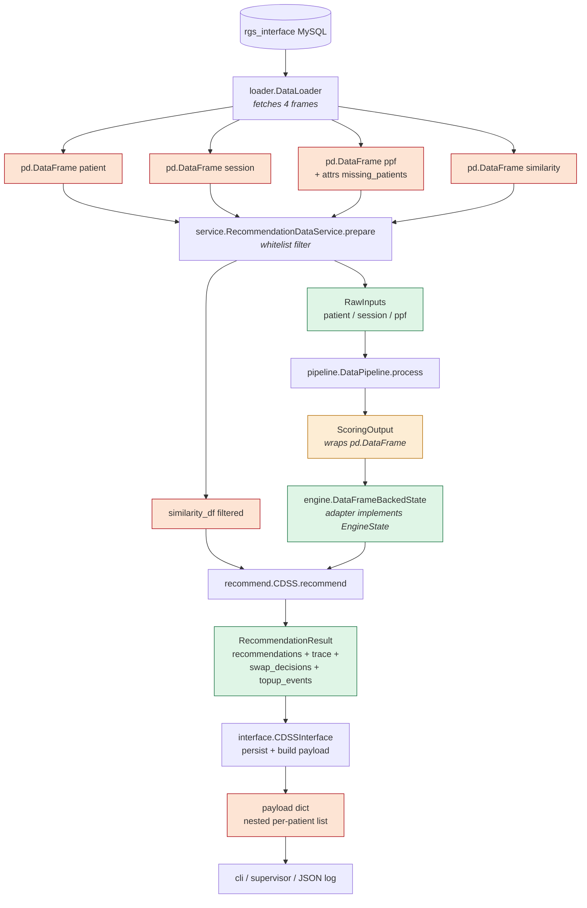
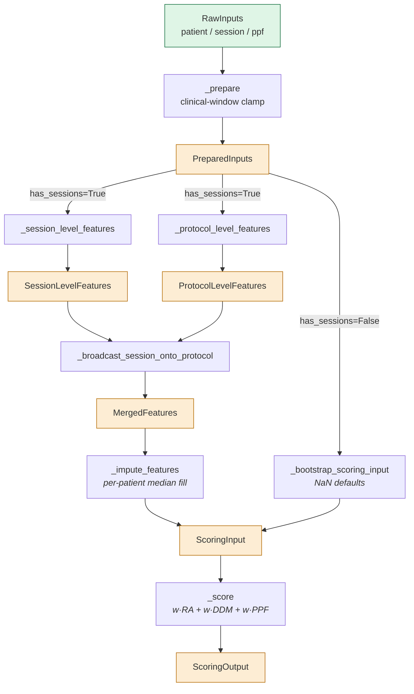
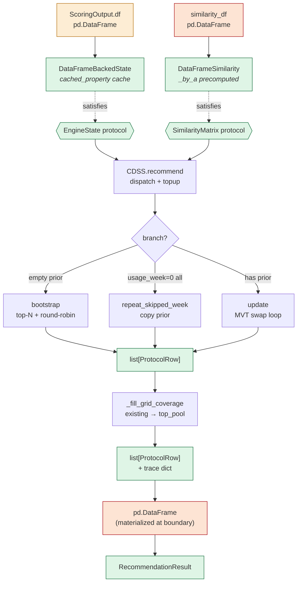
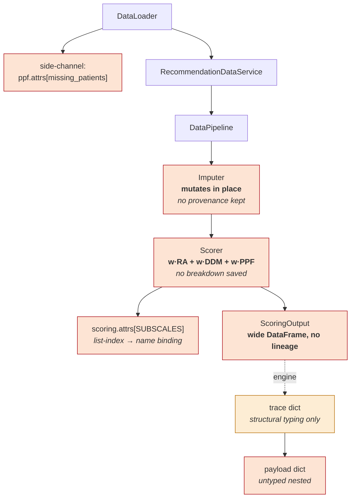
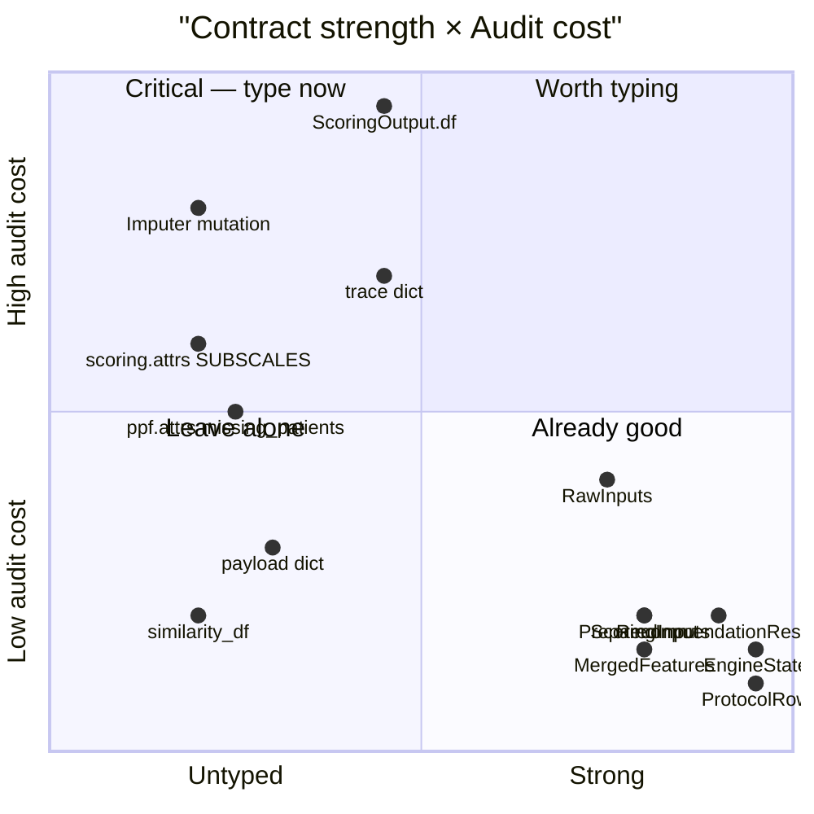

# Current dataflow — visual reference

Renders as Mermaid in GitHub / VS Code (with `bierner.markdown-mermaid`)
/ Obsidian. Colors track contract strength:

- 🟢 **green** — strongly typed (frozen dataclass with column validation,
  or PEP 544 Protocol)
- 🟡 **yellow** — weakly typed (dataclass wrapping a DataFrame; columns
  enforced only via a REQUIRED list)
- 🔴 **red** — untyped (raw `pd.DataFrame` or dict)

## A · Top-level flow

**Reading the diagram:**

- Four raw DataFrames come out of the loader. Red — no schema validation, no contract.
- Service produces `RawInputs` (green dataclass) plus the still-untyped similarity DataFrame.
- Pipeline produces `ScoringOutput` (yellow — typed wrapper around a DataFrame; columns checked but values are pure pandas).
- Engine adapts the DataFrame to `DataFrameBackedState` (green — Protocol-conforming). Engine internals operate on `list[ProtocolRow]`.
- CDSS returns `RecommendationResult` (green dataclass with cached_property breakdowns).
- CDSSInterface unwraps the result into an untyped nested dict for the cli / supervisor / JSON log.

## B · Pipeline internals (zoom into the green PIPE box)

**Five named boundaries, each a frozen dataclass with declared
REQUIRED columns.** The yellow color means "DataFrame inside a typed
wrapper" — column presence enforced, value-level pandera validation
not running.

## C · Engine internals (zoom into the green STATE → CDSS box)

**Engine is the most strongly-typed region in the package.** Both
inputs are coerced to Protocol-satisfying types at the boundary;
internals work in `list[ProtocolRow]`; output materializes to
`pd.DataFrame` only at the very last step.

## D · Where each audit problem lives (overlay)

**Six audit holes**, top-to-bottom by stage:

1. **`ppf.attrs["missing_patients"]`** — side-channel state.
   `.copy()` preserves it but most pandas ops don't.
2. **`Imputer` mutations** — silent. Imputed cells indistinguishable
   from real values after this stage.
3. **`Scorer` formula** — computed wide, no per-component breakdown
   captured.
4. **`scoring.attrs["SUBSCALES"]`** — list-index to subscale-name
   binding lives in `.attrs`. Mismatch waiting to happen.
5. **`ScoringOutput.df`** — wide DataFrame, no lineage column, no
   provenance.
6. **`trace` dict** — structural typing only. `reason` / `source`
   are stringly-typed enums.

## E · Reference: contract strength by stage

Top-left quadrant (high audit cost, weakly typed) is the priority
work. `ScoringOutput.df`, `trace dict`, `Imputer mutation`, and
`scoring.attrs[SUBSCALES]` all sit there.
